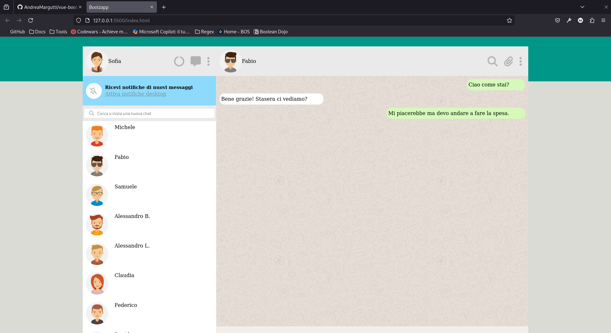

# Boolzapp

## Descrizione
Il progetto nasce come replica di Whatsapp Web, svolto durante i mesi del corso in FULL-STACK WEB DEVELOPMENT di Boolean con lo scopo di familiarizzare con i meccanismi base di `Vue.js` (utilizzato tramite CDN).